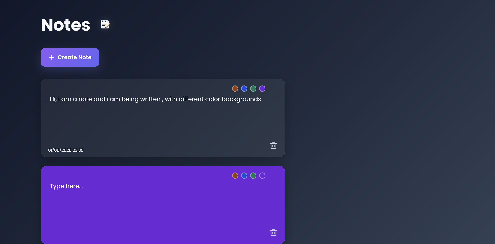

📝 Notes App

A modern and visually appealing Notes Application built using **HTML, CSS, and JavaScript**. This project allows users to create, edit, organize, and customize notes with automatic saving through Local Storage, ensuring that notes remain available even after the browser is closed.

 Features

* Create unlimited notes
* Edit notes directly inside the card
* Delete notes instantly
* Choose custom note colors
* Automatic Local Storage persistence
* Date and time tracking for each note
* Responsive and modern UI design
* No external database required

🛠️ Technologies Used

* HTML5
* CSS3
* JavaScript (ES6)
* Local Storage API

🚀 Learning Outcomes

Through this project, I practiced:

* DOM Manipulation
* Event Handling
* Dynamic Element Creation
* Local Storage Management
* JavaScript Date & Time APIs
* Responsive UI Design

📸 Preview

  AUTHOR
  SYED NOOR UL ABSAR

  
